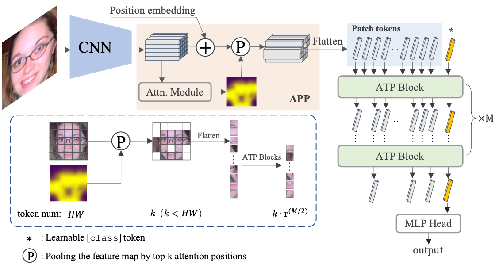

APViT: Vision Transformer With Attentive Pooling for Robust Facial Expression Recognition
==

<div align="center">
  
</div>

APViT is a simple and efficient Transformer-based method for facial expression recognition (FER). It builds on the [TransFER](https://openaccess.thecvf.com/content/ICCV2021/html/Xue_TransFER_Learning_Relation-Aware_Facial_Expression_Representations_With_Transformers_ICCV_2021_paper.html), but introduces two attentive pooling (AP) modules that do not require any learnable parameters. These modules help the model focus on the most expressive features and ignore the less relevant ones. You can read more about our method in our [paper](https://arxiv.org/abs/2212.05463).

## Update

- **2023-05-16**: We add a Colab demo for inference, test and training on RAF-DB: [](https://colab.research.google.com/drive/1dwR-30Gt6Twbqsj5FXqaVzXlgtp6Z7Ll?usp=sharing)
- 2023-03-31: Added an [notebook demo](demo.ipynb) for inference.


## Installation

This project is based on [MMClassification](https://github.com/open-mmlab/mmclassification) and [PaddleClas](https://github.com/PaddlePaddle/PaddleClas), please refer to their repos for installation.

Notable, our method does not rely on custome cuda operations in mmcv-full.

The pre-trained weight of IR-50 weight was downloaded from [face.evoLVe](https://github.com/ZhaoJ9014/face.evoLVe/#model-zoo), and 
ViT-Small was downloaded from [pytorch-image-models](https://github.com/rwightman/pytorch-image-models/releases/download/v0.1-weights/vit_small_p16_224-15ec54c9.pth). 

### Data preparation

1. We use the face alignement codes in [face.evl](https://github.com/ZhaoJ9014/face.evoLVe/#Face-Alignment) to align face images first.
2. The downloaded RAF-DB are reorganized as follow:

```
data/
├─ RAF-DB/
│  ├─ basic/
│  │  ├─ EmoLabel/
│  │  │  ├─ train.txt
│  │  │  ├─ test.txt
│  │  ├─ Image/
│  │  │  ├─ aligned/
│  │  │  ├─ aligned_224/  # reagliend by MTCNN
```
3. We provide a preprocessed version of the RAF-DB, which can be downloaded from (here)[https://github.com/youqingxiaozhua/APViT/releases/download/V1.0.0/RAF-DB.zip]. The password of the zip file is calculated by adding the pixel values of the `RAF-DB/basic/Image/aligned/test_0001_aligned.jpg` image. To obtain the password, use the following code:

```Python
import cv2
print(cv2.imread('data/RAF-DB/basic/Image/aligned/test_0001_aligned.jpg').sum())
```

### PaddlePaddle Version

The PaddlePaddle version of TransFER is included in the [Paddle](Paddle) folder.


## Training

To train an APViT model with two GPUs, use:

```shell
python -m torch.distributed.launch --nproc_per_node=2 \
    train.py configs/apvit/RAF.py \
    --launcher pytorch
```

## Evaluation

To evaluate the model with a given checkpoint, use:

```shell
PYTHONPATH=$(pwd):$PYTHONPATH \
python -m torch.distributed.launch --nproc_per_node=2 \
    tools/test.py configs/apvit/RAF.py \
    weights/APViT_RAF-3eeecf7d.pth \   # your checkpoint
    --launcher pytorch
```

## Pretrained checkpoints

| Model | RAF-DB | Config   | Download |
|-------|--------|----------|----------|
| APViT | 91.98%  | [config](configs/apvit/RAF.py) | [model](https://pan.baidu.com/s/1nuSigUoyV2qEB6WMtzUWFQ?pwd=axfc)  |


## License

This project is released under the [Apache 2.0 license](LICENSE).


## Reference
If you use APViT or TransFER, please cite the paper:

```
@article{xue2022vision,
  title={Vision Transformer with Attentive Pooling for Robust Facial Expression Recognition},
  author={Xue, Fanglei and Wang, Qiangchang and Tan, Zichang and Ma, Zhongsong and Guo, Guodong},
  journal={IEEE Transactions on Affective Computing},
  year={2022},
  publisher={IEEE}
}

@inproceedings{xue2021transfer,
  title={Transfer: Learning Relation-aware Facial Expression Representations with Transformers},
  author={Xue, Fanglei and Wang, Qiangchang and Guo, Guodong},
  booktitle={Proceedings of the IEEE/CVF International Conference on Computer Vision},
  pages={3601--3610},
  year={2021}
}
```
